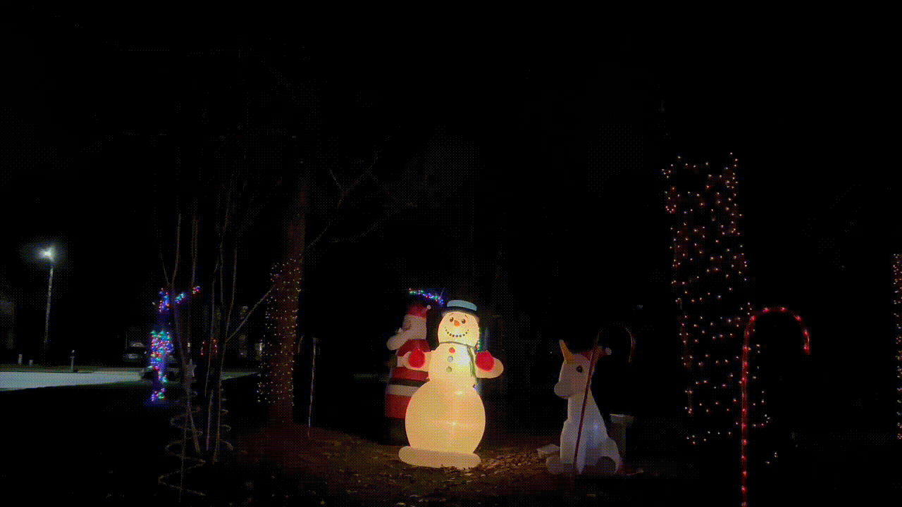

<p align=center>
    
</p>

<p align="center">Control lights and music for Raspberry Pi and more.</p>



## Prerequisites

[Node.js](https://nodejs.org/en/), [Yarn (classic)](https://classic.yarnpkg.com/lang/en/), and [SoX](https://github.com/chirlu/sox).

## Setup

```bash
# Install dependencies
yarn
# Build all packages
yarn build:all
# Copy sample config folder to ./config
yarn config:copy
```

### First time run

```bash
yarn workspace @lightshow/server start
```

1. Open the sample preview space @ http://localhost:3000/preview/space/demo-space?events=io.

2. To play the sample track, click the ▶️ icon in the upper right to view the listing and click the track.

3. Watch the demo space do it's thing!

https://user-images.githubusercontent.com/1138977/166842183-57cc2f4c-6014-421e-90fc-7edd84f323cd.mov
